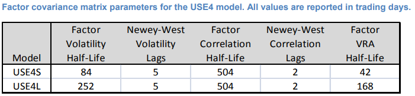

# USE4 Methodology Notes

## 1. Introduction

### 1.3 Forecasting Portfolio Risk with Factor Models
- Key Assumptions
    1.	the factor returns are uncorrelated with the specific return
    2.	the specific returns are uncorrelated among themselves 
- Notations
    - stock return $r_n$ explained as $$r_n = \sum_k{X_{nk}f_k} + u_n$$ 
    - $X_{nk}$ is the exposure of stock $n$ to factor $k$
    - $f_k$ is the return to the factor 
    - $u_k$ is the stock specific return

## 2. Factor Exposures

### 2.1 General Considerations
- Factor capture _all systematic drivers_ of asset returns, thus implying that the specific returns are mutually uncorrelated.
- __Parsimony__(简约）：meaning that the systematic component of asset returns is explained with the fewest possible number of factors 
- __Statistical significance__ of the factor returns
- __Stability__: typical stock exposures do not change drastically over short periods of time, which can be problematic from a risk management perspective. _factor stability coefficient_ above 0.90 are considered desirable, which defined as  
$$ \rho_{kt} = \frac{\sum_n{v_n^t (X_{nk}^t - \bar{X_k^t})(X_{nk}^{t+1} - \bar{X_k^{t+1}})}} {\sqrt{\sum_n{v_n^t(X_{nk}^t -\bar{X_k^t})^2}}\sqrt{\sum_n{v_n^t(X_{nk}^{t+1} - \bar{X_k^{t+1}})^2}}} $$  
    where $v_n^t$ regression weight of stock $n$ at time $t$
- __Limited Collinearity__ measured by the _Variance Inflation Factor_(VIF), which defined as $$ VIF_k = \frac{1}{1-R_k^2} $$
    where $R_k^2$ is the _R-Squared_ of the regression $$ X_{nk} = \sum_{k' \neq k}{X_{nk'}b_{k'}} + \varepsilon_{nk},$$ collinearity can be reduced by factor rotation procedure known as orthogonalization.

### 2.2 Data Quality and Outlier Treatment
- Outlier algorithm: Three types of data and their treatements:
    1. __Extreme Values__ treated as potential data errors: removed from the estimation process
    2. __Legitimate(治理的）but large nonetheless__: trim to three standard deviations from the mean
    3. Forming the bulk of the distribution(consists of values that areless than three standard deviations from the mean): left unadjusted.
- Missing: data-replacement algorithm
    - Regress non-missing exposures against a subset of factors with the slope coefficients being used to estimate the factor exposures for the stock with missing data.
    - Notice the algorithm is applied at __the factor level__ as opposed to the descriptor level, only if all descriptors are absent does the replacement algorithm become active.
    
### 2.2 Data Quality and Outlier Treatment
Outlier algorithm: Three types of data and their treatements:
1. __Extreme Values__ treated as potential data errors: removed from the estimation process
2. __Legitimate(合理的）but large nonetheless__: trim to three standard deviations from the mean
3.	Forming the bulk of the distribution(consists of values that areless than three standard deviations from the mean): left unadjusted.
    - Missing: data-replacement algorithm
    - Regress non-missing exposures against a subset of factors with the slope coefficients being used to estimate the factor exposures for the stock with missing data.
    - Notice the algorithm is applied at __the factor level__ as opposed to the descriptor level, only if all descriptors are absent does the replacement algorithm become active.

### 2.3 Style Exposures
- Descriptors represent financially intuitive stock attributes and serve as effective predictors of equity return covariance. A Descriptor $d_{nl}$ is standardized as $$d_{nl}= \frac{d_{nl}^{Raw} - \mu_l}{\sigma_l}$$
- $d_{nl}^{Raw}$ : the raw value of stock $n$ for descriptor $l$
- $\mu_l$ : the cap-weighted mean of the descriptor(within the estimation universe)
- $\sigma_l$ : the equal-weighted standard deviation(prevent large-cap stocks from having an undue influence on the overall scale of the exposures)

### 2.4 Industry Factors
- Using a single level of the GICS hierarchy will fail to capture the unique characteristics of each financial market. 
- Basic criteria to guide industry factor selection
    1.	economically intuitive
    2.	industry factors should have a strong degree of statistical significance
    3.	incorporating an additional industry factor should significantly increase the explanatory power of the model
    4.	thin industries (those with few assets) should be avoided
    
### 2.5 Multiple-Industry Exposures
- Modeled in USE4 by examining the impact of two key explanatory variables, __Assets__ and __Sales__, on the market value of a given stock.  
$$ X_{nk} = 0.75 \cdot X_{nk}^A +0.25 \cdot X_{nk}^S $$
- Assets exposures $X_{nk}^A$ defined as  
$$ X_{nk}^A = \frac{A_{nk}\beta_k^A}{\sum_k{A_{nk}\beta_k^A}} \in (0,1) $$  
where $A_{nk}$ and $\beta_k^A$ calculate by regression  
$$ M_n = \sum_k{A_{nk}\beta_k^A} + \varepsilon_n $$
    - $M_n$ is the market capitalization of stock $n$
    - $A_{nk}$ is the asset of the stock within industry $k$
    - $\beta_k^A$ is the industry beta, which can be interpreted as the price-to-assets ratio of the industry
    - $\varepsilon_n$ is the residual and $\sum_k{A_{nk}\beta_k^A}=1$
- Parsimony Requirement: The maximum allowable number of multiple-industry exposures is limited to five. If a firm has more than five business segments, the top five are taken and the industry exposures are re-normalized to 1.

#%% md
## 3. Factor Returns
- Local __excess__ returns $r_n$ are explained by  
$$ r_n = f_c +\sum_i{X_{ni}f_i} + \sum_s{X_{ns}f_s} + u_n \\ \text{s.t.} \sum_i{w_i f_i} = 0 $$  
with weighted least-squares regression where
    - $f_c$: the return of the country factor
    - $f_i$: the return of industry factor $i$
    - $f_s$: the return of style factor $s$
    - $u_n$: the specific return
- assuming that the variance of specific returns is inversely proportional to the _square root of total market capitalization_, reflects the empirical observation that the idiosyncratic risk of a stock decreases as the market capitalization of the firm increases.
- the constrain $\sum_i{w_i f_i} = 0$ aviod collinearity, $w_i$ is the capitalization weight of the estimation universe in industry $i$.

### 3.1 Country Factor
- Explicit Inclusion of the Country Factor beneficial in two ways:
    1.	disentangles(分开）the market effect from the pure industry effect
    2.	more accurate risk forecasts and more responsive correlations
- The country factor essentially represents the cap-weighted estimation universe  
$$ R_E = f_c + \sum_i{w_i f_i} + \sum_s{X_s^E f_s} + \sum_n{h_n^E u_n} \approx f_c $$  
Cumulative returns of the USE4 Country factor and the USE4 estimation universe (in excess of risk-free rate).The two portfolios track each other veryclosely over the 16-year sample window, with a time-series correlation of 99.9 percent.(see _USE4 MethodoLogy Figure 3.1_)
#%% md
## 4. Factor Covariance Matrix 

### 4.1 Established Methods - GEM2
The USE4 factor covariance matrix builds upon methodologies used in the Barra Global Equity Model, GEM2, as described by Henchero, Morozov, and Shepard(2008).

1. Factor Correlation Matrix
    - Exponentially weighted averages with half-life $\tau_{\rho}^F$, an effective method for dealing with data non-stationarity.
        - $\tau_{\rho}^F$ must be sufficiently long(effective number of observations $T$ is significantly greater than the number of factors $K$) in case of spuriously low factor risk.
        - If the $\tau_{\rho}^F$ is too long, then undue weight is placed on distant observations that have little relation to current market conditions.
    - __Prediction Horizon__ : 1 month
    - Serial-Correlation Effects: __Newey-West__ methodology(1987). Key parameter in Newey-West is the number of lags $L_{\rho}^F$ over which the serial correlation is deemed important.(假设单期的因子收益率 $F_t$ 满足一个 $L_{\rho}^F$ 阶的序列相关性，即 $F_t$ 可以用 MA($L_{\rho}^F$) 来刻画 [[石川: 协方差矩阵的 Newey-West 调整]][1] )
    - Correlation matrix for the case of missing factor returns: __EM algorithm__
    The EM algorithm also refines(改善) the correlation forcasts while ensuring positive semi-definite(半正定) matrix.
2. Factor Volatilities: Exponentially weighted averages + Newey-West approach.
    - In general, the volatility half-life can be made considerably shorter than the correlation half-life.
3. Construct the initial covariance matrix by scaling in the factor volatilities.
    - Covariance between factors $i$ and $j$ is given by $$F_{ij}^0 = \rho_{ij}\sigma_i\sigma_j$$

### 4.2 Eigenfactor(特征值) Risk Adjustment
> Menchero, J., J. Wang, and D. J. Orr (2011). Eigen-adjusted Covariance Matrices. MSCI Research Insight.

- Shepard(2009) derived an analytic result for the magnitude of the bias. Under assumptions of normality and stationarity (and massive asset $K$), he found with $K$ factors and $T$ effective number of observations,
    $$\sigma_{true} \approx \frac{\sigma_{pred}}{1-(K/T)} $$

[1]: https://zhuanlan.zhihu.com/p/38506157
#%% md
- https://github.com/ShiliangZhang-nku/Barra_CNE6
- https://zhuanlan.zhihu.com/p/73794358
#%%